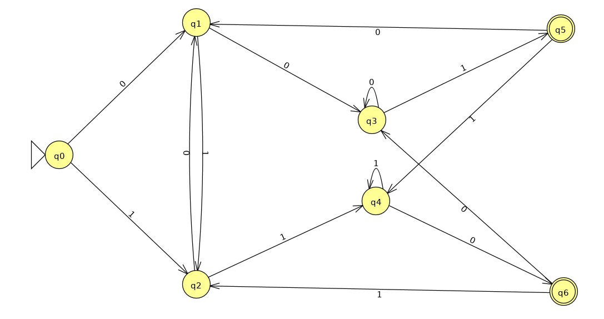

<!-- TOC depthFrom:1 depthTo:6 withLinks:1 updateOnSave:1 orderedList:0 -->

- [Esercizi DFA](#esercizi-dfa)
	- [Esercizi slide 2](#esercizi-slide-2)
		- [Esercizio 3](#esercizio-3)
		- [Esercizio 4](#esercizio-4)
	- [Esercizi extra](#esercizi-extra)
- [Esercizi NFA](#esercizi-nfa)
	- [Esercizi slide 2](#esercizi-slide-2)
		- [Esercizio 2 (pag 24)](#esercizio-2-pag-24)
		- [Esercizio 3 (pag 25)](#esercizio-3-pag-25)

<!-- /TOC -->

# Esercizi DFA
## Esercizi slide 2

### Esercizio 3
DFA che accetta l'insieme di tutte le stringhe in {0, 1}* che contengono 3 zeri anche non consecutivi.

### Esercizio 4
DFA che accetta l'insieme delle stringhe in {0, 1}* che cominciano o finiscono (o entrambe le cose) con 01.

## Esercizi extra
DFA che accetta l'insieme delle stringhesull'alfabeto {0, 1} tali che ogni blocco di 5 simboli consecutivi contenga almeno due 0.

# Esercizi NFA
## Esercizi slide 2

### Esercizio 2 (pag 24)
DFA ottenuto dalla costruzione per sottoinsiemi a partire dall'NFA.

### Esercizio 3 (pag 25)

*Linguaggio riconosciuto dall'automa:* Stringhe in {0, 1}* che  finiscono in 001 oppure 110.

