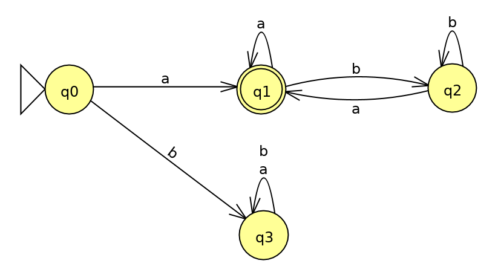
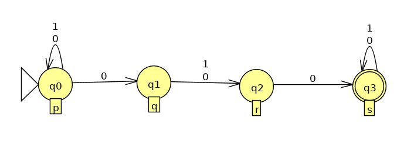
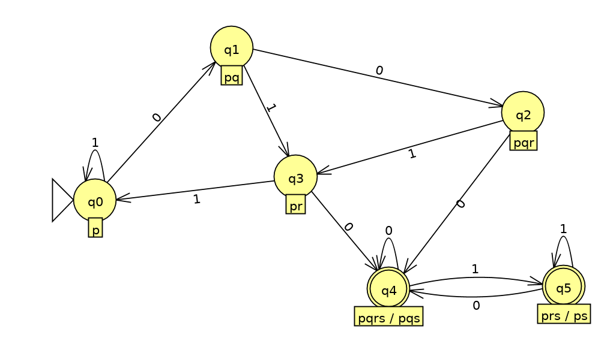

<!-- TOC depthFrom:1 depthTo:3 withLinks:1 updateOnSave:1 orderedList:0 -->

- [Correzione del compitino del 9 Aprile](#correzione-del-compitino-del-9-aprile)
	- [Esercizio 1](#esercizio-1)
		- [Punto a](#punto-a)
		- [Punto b](#punto-b)
	- [Esercizio 2](#esercizio-2)
	- [Esercizio 3](#esercizio-3)
	- [Esercizio 4](#esercizio-4)
	- [Esercizio 5 (CFG)](#esercizio-5-cfg)
- [Esercizi su gammatiche CFG](#esercizi-su-gammatiche-cfg)
	- [Esercizi vari](#esercizi-vari)
		- [Esercizio T1](#esercizio-t1)
		- [Esercizio T2 (es 2 pag 8)](#esercizio-t2-es-2-pag-8)
		- [Esercizio T3](#esercizio-t3)

<!-- /TOC -->

# Correzione del compitino del 9 Aprile

## Esercizio 1

### Punto a
Disegnare un DFA che accetti L = {stringhe in {a, b}* che iniziano e finiscono per 'a'}

### Punto b
Dare un'espressione regolare che rappresenti il linguaggio L.

Soluzione: `a(a+b)*a + a`

## Esercizio 2
Convertire l'NFA in figura in un DFA.

Con la costruzione per sottoinsiemi si ottiene la seguente tabella.

|         |    0   |   1    |
|:-------:|:------:|:------:|
| -> p    |   pq   |    p   |
|    pq   |   pqr  |   pr   |
|   pqr   |  pqrs  |   pr   |
|   pr    |   pqs  |   p    |
|  pqrs*  |  pqrs  |  prs   |
|   pqs*  |  pqrs  |  prs   | (pqs = pqrs)
|   prs*  |  pqs   |   ps   |
|   ps*   |  pqs   |   ps   | (prs = ps)

Gli stati `pqrs` e `pqs` possono essere fatti collassare in un solo stato, visto che sono entrambi finali e hanno le stesse transizioni. Stesso discorso vale per `prs` e `ps`.

L'automa deterministico che risulta è il seguente:

## Esercizio 3
L = {anbmcn-m | n > m > 0} è regolare?

Non è regolare. Per dimostrarlo formalmente è sufficiente mostrare che nega il Pumping Lemma.

Sia `n` la lunghezza data dal Pumping Lemma.
Prendo una parola `w` (&isin; L) nella forma anbmcn-m con n > m > 0.
Scelgo un `k` &ge; 0 in modo che &forall; split `w = x y z`:

- |xy| &le; n
- y &ne; &epsilon;
- x yk z &notin; L.

Per le prime due delle 3 condizioni `y` deve essere composta da almeno una 'a'. Indico questo numero con `p`. Allora scelgo `k = 0` e allora  `w'` = x y0 z = an-pbmcn-m. Questa stringa non può essere in L.

Siccome nega il PL, L non è regolare.

## Esercizio 4
Sia `L` un linguaggio regolare su un alfabeto &Sigma;. Dimostrare che anche il seguente linguaggio è regolare:

*init(L)* = {w &isin; &Sigma;&ast; | esiste `x` &isin; &Sigma;&ast; tale che `wx` &isin; L}

Questo liguaggio è regolare perchè è possibile costruire un automa che lo accetta. Infatti *init(L)* è il linguaggio dei prefissi (propri e imporopri) di `L`. Quindi è sufficiente:

- disegnare l'automa (NFA) M che accetta `L`.
- disegnare un nuovo automa N, uguale al precedente ma con un nuovo e unico stato finale `f`.
- da ogni stato di N che in M poteva (con qualunque cammino) raggiungere uno stato finale, inserisco una &epsilon;-transizione verso `f`.

A questo punto N può accettare tutti i prefissi delle stringhe in `L` (incluse le stringhe in L stesse). Quindi L(N) = init(L) è regolare.

## Esercizio 5 (CFG)
Data la CFG G:

S => aSb | aSa | bSa | bSb | &epsilon;

Rispondere alle seguenti domande.

1. Descrivere il linguaggio L generato da G.
  - L = {w | w &isin; {a, b}* tale che |w| sia pari}.
2. Dimostrare che L=L(G). `w` &isin; L(G) <=> `w` &isin; L

  - **Dimostrazione =>**
    Per induzione sul numero di passi di derivazione (`n`).

    CASO BASE:

    n = 1 => S => &epsilon;. Questa parola &isin; L.

    INDUZIONE: (n &ge; 2)

    Supponiamo che ogni stringa prodotta in (n-1) passi di derivazione sia anche in L.
    Allora, per fare `n` passi la produzione deve cominciare con:

    1. S => aSb (n-1)=> a x b
    2. S => aSa (n-1)=> a y a
    3. S => bSa (n-1)=> b w a
    4. S => bSb (n-1)=> b z b

    In tutti e 4 i casi `x, y, w, z` sono prodotte in (n-1) passi e per ipotesi induttiva appartengono ad L. Pertanto aggiungendo una lettera all'inizio e alla fine la stringa generata in `n` passi sarà sempre di lunghezza pari. Quindi tutte le stringhe ottenute &isin; L.

  - **Dimostrazione <=**
    Per induzione sulla lunghezza di `w`, |w| = n.

    CASO BASE:

    n = 0 ==> w = &epsilon;. È generata con S => &epsilon;.

    INDUZIONE: (n &ge; 2)

    Ogni stringa di lunghezza pari è nella forma `w = l x l` con `l` &isin; {a, b}. Siccome `x` deve essere in `L`, suppongo per ipotesi induttiva che `S *=> x`. Allora posso usare una delle prime quattro produzioni e ottenere `w`. Infatti:

    1. S => aSa => a x a
    2. S => aSb => a x b
    3. S => bSa => b x a
    4. S => bSb => b x b

    Queste sono tutte le possibili stringhe di lunghezza `n` con |x| = (n-2).

3. `L` è un linguaggio regolare. Infatti può essere espresso anche dall'espressione regolare `((a+b)(a+b))*`. In particolare G è una grammatica lineare, perchè contiene al massimo una variabile nel corpo di ogni produzione.

# Esercizi su gammatiche CFG

## Esercizi vari

### Esercizio T1
<!--(es 3 pag 8 raccolta exercises)-->

L = {w &isin; {a, b}* | #a < #b}, ovvero tutte le stringhe con più 'b' che 'a'.

Grammatica:

- E => aEbE | bEaE | &epsilon;
- **S** => EbE | SS

`E` genera tutte le stringhe con numero di 'a' e 'b' uguale (chiamerò questo linguaggio `K`). `S` invece usa `E` per generare tutte le stringhe in L. Ora va dimostrato per induzione. Partendo da dimostrare `E`.

#### DIMOSTRAZIONE per E <!--(es 3.18 libro pag 192)-->
TESI: `w` è generata da E <=> `w` ha ugual numero di 'a' e 'b' (&isin; K)

##### Dimostrazione <=
Per induzione su `|w| = n`

CASO BASE:

- n = 0 ==> w = &epsilon; e c'è la produzione E => &epsilon;
- n = 2 ==> `w = ab | ba` e ci sono le produzioni per generarle.

INDUZIONE: (n > 2, ovvero n &ge; 4)
Se `w` ha `#a = #b` allora può essere scritta come:

1. `x ab y` = w1
2. `x ba y` = w2

Per forza in entrambi i casi `xy` &isin; K. Allora per ipotesi induttiva posso affermare che `E *=> xy`. Inoltre `|xy|` &ge; 2, quindi deve essere generata a partire da una delle prime due produzioni. Per come sono fatte le produzioni la produzione finale che genera `xy` deve essere nella seguente forma: `E *=> x E y`, ovvero tolgo tutte le variabili E con la produzione E => &epsilon;, tranne una.
Allora nei rispettivi casi:

1. Uso la prima produzione e ottengo E *=> x E y => x aEbE y => `x ab y = w1`.
2. Uso la seconda produzione per ottenere E *=> x E y => x bEaE y => `x ba y = w2`.

##### Dimostrazione =>
TESI: `w` è generata da E ==> `w` ha ugual numero di 'a' e 'b' (&isin; K)
Per induzione sulla lunghezza della derivazione (`n`).

CASO BASE:

- n = 1 ==> E => &epsilon; che &isin; K.

INDUZIONE: (n > 1)
Allora bisogna cominciare con la prima o seconda produzione:

1. E => aEbE (n)=> `a x b y`.
2. E => bEaE (n)=> `b x a y`.

Visto che `x` e `y` sono prodotte in `n` passi applico l'ipotesi induttiva per sostenere che entrambe le stringhe siano in `K`.
Quindi con un passo di derivazione in più vengono aggiunte una 'a' e una 'b' in tutti e due i casi. Quindi `a x b y` e `b x a y` devono appartenere a `K`.

#### DIMOSTRAZIONE (per S)
w &isin; L <=> w è generata da S.

##### Dimostrazione =>
Se `w` ha più 'b' che 'a' allora è in una delle seguenti forme:

1. Se `w` ha esattamente una 'b' in più è possibile scomporla in:
  - `w = x b y` con `x` e `y` &isin; K. È generata con `S => EbE => xby`.
2. Se ha `n` &ge; 2 lettere 'b' in più rispetto alle 'a' allora può sempre essere spezzata in:
  - `w` = x1x2x3...xn, dove ogni sequenza xi ha esattamente una lettera 'b' in più rispetto al numero di 'a'.

Per cui ogni xi del caso 2. rientra nelle stringhe descritte nel caso 1. Ma allora con la produzione S => SS ripetuta (n-1) volte e poi sostituendo ad ogni `S` la produzione `EbE` posso generare una concatenazione di qualunque stringa con esattamente una 'b' in più rispetto al numero di 'a'.

##### Dimostrazione <=
Per induzione sul numero di passi di derivazione. Sia `n` tale numero.

CASO BASE: (n = 2)

- S => EbE => b. Ok, questa stringa &isin; L.

INDUZIONE: (n &ge; 3)

- S => SS (n)=> `x y`.
- S => EbE (n)=> `x b y`.

Nel primo caso suppongo per ipotesi induttiva che `x` e `y` &isin; `L`, visto che sono prodotte in `n` passi. Allora la loro concatenazione, generata in `(n+1)` passi, deve essere in `L`.

Nel secondo caso so già, avendo dimostrato il linguaggio di E, che `x`, `y` &isin; K (hanno lo stesso numero di 'a' e 'b'). Allora aggiungendo una 'b' si ottiene una stringa in `L`.

### Esercizio T2 (es 2 pag 8)

L = {akblam | m = k + l}

Grammatica:

- **S** => aSa | B
- B => bBa | &epsilon;

#### Dimostrazione per B
Sia `K` = {w | w = bmam}, il linguaggio delle stringhe prodotte da `B`.

TESI: `w` &isin; K => `w` è generata da `B`.
Si dimostra per induzione sulla lunghezza di `w` (|w| = n).

CASO BASE:

- n = 0 ==> w = &epsilon;. È generata con B => &epsilon;

INDUZIONE: (n &ge; 2)
Ogni stringa in K di lunghezza (n+2) può essere scomposta in: `w = b x a`, con `x` &isin; K. Invoco l'ipotesi induttiva su `x`, visto che |x| = n. Pertanto `B *=> x`.

Allora con la prima produzione posso ottenere `w`: `B => b B a *=> b x a`. Quindi ogni stringa in `K` può essere prodotta da `B`.

TESI: `w` generata da `B` => `w` &isin; `K`.
Per induzione sul numero di passi di derivazione (`n`).

CASO BASE:

- n = 1 ===> B => &epsilon;, la quale è una stringa &isin; K.

INDUZIONE: (n &ge; 2)
Per fare almeno due passi di derivazione è necessario usare la prima produzione:
`B => bBa (n-1)=> b x a`. Invoco l'ipotesi induttiva per sostenere che `x` sia in `K`, in quanto stringa prodotta in (n-1) passi.

Se x = bmam, aggiungendo una 'b' iniziale e una 'a' alla fine ottengo una stringa
`w` = bm+1am+1, che è sempre in `K`.

#### Dimostrazione per S
TESI: `w` &isin; L <=> `w` generata da **S**.

##### Dimostro =>
Per induzione sulla lunghezza di `w`, indicata con `n`.

CASO BASE:

- n = 0 ==> w = &epsilon;. È generata con S => B => &epsilon;

INDUZIONE: (n &ge; 2)
`w` = akblal+k.
Se:

1. k = 0. Allora per la dimostrazione precedente qualunque stringa nella forma blal è generata con S => B *=> `w`.
2. k &ge; 1. Allora `w = a x a`, con `x` = ak-1blal+k-1. Applico l'ipotesi induttiva su `x` per sostenere che `S *=> x`. A questo punto è facile generare `w` con
  - `S => aSa *=> a x a == w`.

##### Dimostro <=
Per induzione sul numero di passi di derivazione (n).

CASO BASE:

- n = 2 ===> S => B => &epsilon;, la quale è una stringa &isin; L.

INDUZIONE: (n &ge; 3)
Allora devo iniziare con:

1. S => aSa (n)=> a x a.
2. S => B (n)=> x.

Nel caso 2, `x` sarà &isin; L per la dimostrazione fatta di B. Infatti `K` &sub; `L` (K è il linguaggio delle stringhe prodotte da B).
Nel caso 1 invoco l'ipotesi induttiva per sostenere che `x` &isin; L. Quindi per forza anche `a x a` avrà il corretto numero di 'a' finali, e quindi anche questa stringa &isin; L.

### Esercizio T3
Scrivere una CFG per L.

L = {w &isin; {a, b, c}* | #a + #b = #c}

**S** => SaScS | ScSaS | SbScS | ScSbS | &epsilon;

#### DIMOSTRAZIONE
`w` &isin; L <=> `w` è generata da S.

##### Dimostro =>
Si fa per induzione su |w| = n.

CASO BASE:

- |w| = 0. Allora `w` = &epsilon;. È generata con S => &epsilon;

INDUZIONE: (|w| &ge; 2)
Se `w` &isin; L allora può sempre essere scritta come:

1. w1 = `x ac y`
2. w2 = `x ca y`
3. w3 = `x cb y`
4. w4 = `x bc y`

Allora `xy` &isin; L e ovviamente `|xy| = n-2` (posto che |w| = n). Allora suppongo, per ipotesi induttiva che `S *=> xy`. Però, per come sono fatte le produzioni, la produzione che genera `xy` sarà di questo tipo:
S *=> x S y => xy. Quindi posso fare un passaggio in più e ottenere:

1. S *=> x S y => x SaScS y => `x ac y`
2. S *=> x S y => x ScSaS y => `x ca y`
3. S *=> x S y => x SbScS y => `x bc y`
4. S *=> x S y => x ScSbS y => `x cb y`

Cioè usando le 4 produzioni posso generare tutte le stringhe dei 4 casi indicati sopra. Quindi qualunqu stringa &isin; L è generabile da `S`.

##### Dimostro <=
Per induzione sul numero di passi di derivazione (`n`).

CASO BASE:

- n = 1: è possibile usare solo S => &epsilon;. E &epsilon; &isin; L.

INDUZIONE: (n &ge; 2)
Per fare almeno 2 passi è necessario cominciare con una delle prime 4 produzioni:

1. S => SaScS (n-1)=> `x a y c z`
2. S => ScSaS (n-1)=> `x c y a z`
3. S => SbScS (n-1)=> `x b y c z`
4. S => ScSbS (n-1)=> `x c y b z`

`x`, `y`, `z` sono tutte prodotte in `n-1` passi, quindi uso l'ipotesi induttiva per sostenere che tutte appartengono ad L.

Ma allora anche le stringhe prodotte nei 4 casi avranno il corretto numero di 'a', 'b' e 'c' in quanto, in tutti i casi sto solo aggiungendo una 'c' e un'altra lettera scelta fra 'a' e 'b'.
