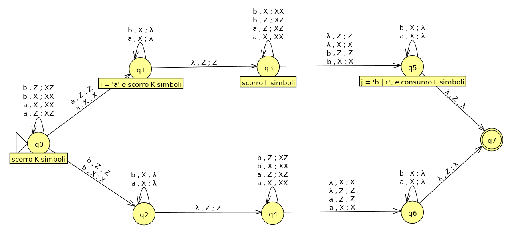
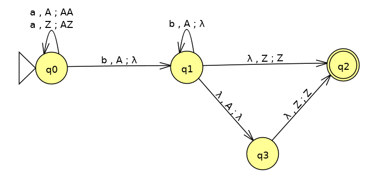
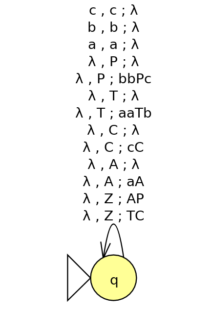
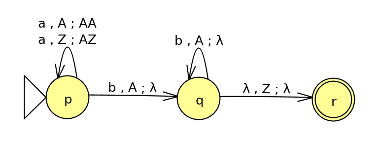
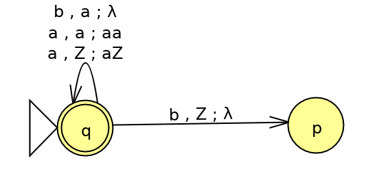
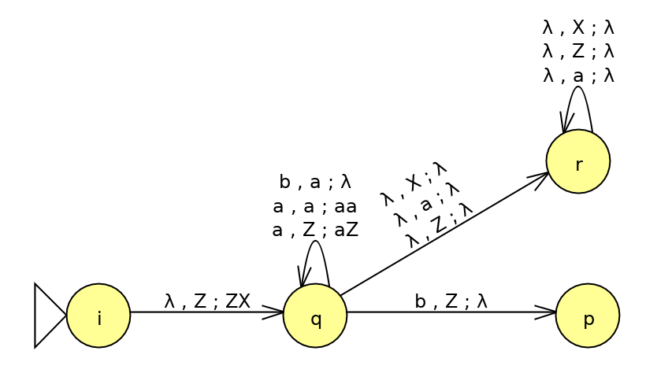
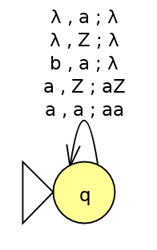

<!-- TOC depthFrom:1 depthTo:3 withLinks:1 updateOnSave:1 orderedList:0 -->

- [Esercizi su PDA](#esercizi-su-pda)
	- [Esercizi pag 251 del libro](#esercizi-pag-251-del-libro)
		- [Esercizio 6.2.3.b](#esercizio-623b)
	- [Altro esercizio](#altro-esercizio)
		- [Esercizio T1 da esame](#esercizio-t1-da-esame)
- [Conversioni PDA <=> CFG](#conversioni-pda-cfg)
	- [Esercizi pag 261 del libro](#esercizi-pag-261-del-libro)
		- [Esercizio 6.3.2](#esercizio-632)
		- [Esercizio 6.3.5.b](#esercizio-635b)
	- [Altri esercizi](#altri-esercizi)
		- [Esercizio T2](#esercizio-t2)
		- [Esercizio T3 (da esame)](#esercizio-t3-da-esame)

<!-- /TOC -->

# Esercizi su PDA

## Esercizi pag 251 del libro

### Esercizio 6.2.3.b

Automa a pila che accetta stringhe in {a, b}\* che **NON** sono nella forma `ww`, ovvero non sono formate da una stringa ripetuta.

È utile evidenziare una proprietà di tutte le stringhe che sono nella forma `ww`.
- Sia `w` una qualunque stringa in forma `w = xx`. Queste stringhe devono essere di lunghezza pari e quindi sia `|w| = 2t`.
Chiamo xi il simbolo in posizione `i` della stringa `x`.
Allora xi+t = xi, &forall; `i` tale che 1 &le; `i` &le; t (considerando che l'indice del primo simbolo sia 1).

Allora deve essere anche vero che una stringa che **non** sia nel formato `ww` deve avere almeno una coppia per cui non valga questa proprietà, ovvero una coppia xi+t &ne; xi

L'automa quindi si assicurerà di accettare solamente stringhe per le quali esista almeno una di tali coppie.

P = ({q0, q1, q2, q3, q4, q5, q6, q7}, {a, b}, {Z, X}, &delta;, q0, Z, {q7})

Disegno dell'automa P che accetta per stato finale:

L'automa legge un numero `k` di simboli. Poi, nondeterministicamente sceglie la xi. In seguito legge altri `k` simboli e poi altri `l`. Quando trova un simbolo diverso da xi, prova a considerarlo come elemento xi+t. Se poi legge esattamente `l` simboli allora accetta, altrimenti questo ramo 'morirà'.
Le stringhe dispari sono sempre accettate perchè un match sempre valido è xi+t = &epsilon;

## Altro esercizio

### Esercizio T1 da esame
Data la seguente grammatica libera da contesto G:

- **S** => aB
- B => Ab | b
- A => aB | a

Rispondere alle seguenti domande:
a. Dare una definizione del linguaggio di G;
b. Dimostrare induttivamente  che G produce tutte e sole le stringhe del linguaggio;
c. Descrivere un automa pila che riconosca L(G) per stato finale e spiegare perché secondo voi funziona.

I primi due punti sono già stati svolti nell'esercizio T1 del Tutorato 4.

L(G) = {w | w = anbm con `n` = `m` oppure `n` = `m+1` con `n` e `m` > 0}

Quindi un automa a pila che accetta L(G) è definito:

P = ({q0, q1, q2, q3}, {a, b}, {A, Z}, &delta;, q0, Z, {q2})

Le transizioni di P sono le seguenti:

Funzionamento:
- con gli stati `q0` e `q1` semplicemente fa match delle 'a' con le 'b' rimuovendo una 'A' dallo stack per ogni 'b' che legge;
- con `q3` prova a togliere una 'A' dallo stack senza leggere input. Se dopo averla tolta vede la 'Z' (il fondo), allora vuol dire che c'è esattamente una 'a' in più rispetto alle 'b'. Quindi la stringa appartiene a L(G) e `P` la accetta, andando nello stato finale (caso `n = m+1`);
- in alternativa, con la transizione fra `q1` e `q2` accetta quando le 'b' inserite hanno consumato tutte le 'A' sulla pila (caso `n = m`);
- per arrivare nello stato `q1`, `P` deve leggere almeno una 'a' seguita da una 'b'. Quindi è garantito che `n > 0` e `m > 0`.

# Conversioni PDA <=> CFG

## Esercizi pag 261 del libro

### Esercizio 6.3.2
Convertire la grammatica G in PDA.

- **S** => aAA
- A => aS | bS | a

Quindi in G:

- V = {S, A}
- T = {a, b}

L'automa costruito sarà:

N = ({q}, T, T &cup; V, &delta;, q, S)

E le sue transizioni sono:
- &delta;(q, &epsilon;, S) = {(q, aAA)}
- &delta;(q, &epsilon;, A) = {(q, aS), (q, bS), (q, a)}
- &delta;(q, a, a) = {(q, &epsilon;)}
- &delta;(q, b, b) = {(q, &epsilon;)}

### Esercizio 6.3.5.b
Definire una CFG per L = {aibjck | i = 2j oppure j = 2k, i, j, k &ge; 0} e convertire in PDA.

La grammatica `G` ha le seguenti produzioni:
- **S** => TC | AP
- A => aA | &epsilon;
- C => cC | &epsilon;
- T => aaTb | &epsilon;
- P => bbPc | &epsilon;

Ora bisogna dimostrare che una stringa `w` &isin; `L` <=>  `w` è prodotta da `G`.
Ometto la dimostrazione per `A` e `C` che sono molto semplici. Infatti produzono semplicemente un qualunque numero di 'a' e 'c'.

Dimostrerò invece che `T` genera `L(T)` = {aibj | i = 2j, con i, j &ge; 0}
e `P` genera `L(P)` = {bjck | j = 2k, con j, k &ge; 0}

#### Dimostrazione =>
Si fa per induzione sulla lunghezza delle stringhe.
Per entrambe le grammatiche le stringhe avranno una lunghezza multipla di 3.

CASO BASE:
- |w| = 0 => `w` = &epsilon;. È prodotta in entrambi i casi.

INDUZIONE: |w| &ge; 3

Una stringa `w` rispettivamente in `L(T)` e `L(P)` dovrà avere la seguente forma:
1. aa`x`b = `w1`. Allora `x` &isin; `L(T)`
2. bb`y`c = `w2`. Allora `y` &isin; `L(P)`

Allora essendo `x` e `y` stringhe di lunghezza `|w|-3` e visto che per forza entrambe devono appartenere ai rispettivi linguaggi, posso supporre che siano prodotte dalle rispettive variabili della grammatica. Ovvero, per ipotesi induttiva:
1. `T *=> x`
2. `P *=> y`

Allora è possibile utilizzare la prima produzione e generare le stringhe iniziali:
1. T => aaTb *=> `aa x b` = `w1`
2. P => bbPc *=> `bb y c` = `w2`

#### Dimostrazione <=
Si fa per induzione sul numero di passi di derivazione.

CASO BASE:
- `n = 1` passo. Allora `T` e `P` possono produrre solo &epsilon; che è in entrambi i linguaggi.

INDUZIONE: n &ge; 2 passi

Allora `w1` e `w2` sono prodotte con la prima produzione:
1. T => aaTb (n-1)=> `aa x b`
2. P => bbPc (n-1)=> `bb y c`

Suppongo per ipotesi induttiva che tutte le stringhe prodotte in `n-1` passi siano appartenenti ai rispettivi linguaggi (L(T) e L(P)). Allora nei due casi precedenti, se `y` e `x` appartengono ai linguaggi, anche `aa x b` e `bb y c` dovranno farlo. Infatti sto solo aggiungendo due lettere prima e una dopo, come richiede il linguaggio.
Quindi l'ipotesi è corretta.

A questo punto è immediato vedere che `S => TC | AP` produce tutte e sole le stringhe in `L`.

#### Conversione in PDA
Una volta dimostrata che la grammatica è corretta è semplice trovare un PDA che accetti per pila vuota lo stesso linguaggio.
NB: Nel disegno la variabile `S` è stata sostituita con `Z`, perche JFLAP vuole `Z` come simbolo iniziale di stack.

N = ({q}, {a, b, c}, {Z, T, C, A, P, a, b, c}, &delta;, q, Z);

## Altri esercizi

### Esercizio T2
1. Costruire un automa a pila che accetti L = {anbn, &forall; n &ge; 1}
2. Convertire l'automa in grammatica libera dal contesto

#### 1. Disegno dell'automa:

#### 2. Conversione in CFG
Per comodità riporto tutte le transizioni:
1. &delta;(p, a, Z) = {(p, AZ)}
2. &delta;(p, a, A) = {(p, AA)}
3. &delta;(p, b, A) = {(q, &epsilon;)}
4. &delta;(q, b, A) = {(q, &epsilon;)}
5. &delta;(q, &epsilon;, Z) = {(r, &epsilon;)}

Produzioni della grammatica:
- Tutti i modi di togliere il simbolo `Z` dallo stato iniziale `p`
  - S => [pZp] | [pZq] | [pZr]
- Dalla produzione 1 (rimuovo `AZ` partendo da `p`):
  - [pZp] => a[pAp][pZp] | a[pAq][qZp] | a[pAr][rZp]
  - [pZq] => a[pAp][pZq] | a[pAq][qZq] | a[pAr][rZq]
  - [pZr] => a[pAp][pZr] | a[pAq][qZr] | a[pAr][rZr]
- Dalla produzione 2 (rimuovo `AA` partendo da `p`, 32 produzioni):
  - [pAp] => a[pAp][pAp] | a[pAq][qAp] | a[pAr][rAp]
  - [pAq] => a[pAp][pAq] | a[pAq][qAq] | a[pAr][rAq]
  - [pAr] => a[pAp][pAr] | a[pAq][qAr] | a[pAr][rAr]
- Dalla produzione 3:
  - [pAq] => b
- Dalla produzione 4:
  - [qAq] => b
- Dalla produzione 5:
  - [qZr] => &epsilon;

### Esercizio T3 (da esame)
Un PDA è così definito: P = ({q, p}, {a, b}, {a, Z}, &delta;, q, Z, {q}) dove &delta; è come segue:

- &delta;(q, a, Z) = {(q, aZ)}
- &delta;(q, a, a) = {(q, aa)}
- &delta;(q, b, a) = {(q, &epsilon;)}
- &delta;(q, b, Z) = {(p, &epsilon;)}

Rispondere alle domande:

1. Descrivere il linguaggio riconosciuto da P.
2. Trasformare P in PDA che accetta per pila vuota lo stesso linguaggio.
3. Determinare una grammatica libera dal contesto che accetti lo stesso linguaggio di P.

#### 1. Descrivere il linguaggio di P
Disegno del PDA:

L'automa accumula 'a' nella pila, e ne consuma una ogni volta che viene letta una 'b'. Quando viene inserita una 'b' in più rispetto al numero di 'a' finora letto, l'automa transita nello stato `p` dove muore.

Quindi L(P) = {w &isin; {a, b}* | ogni prefisso di `w` abbia #a &ge; #b}

#### 2. Trasformare P in un PDA che accetta per pila vuota
Lo stato finale di P dovrà avere una transizione che indipendentemente da cosa sia sulla pila, deve svuotarla.
Secondo la regola è necessario aggiungere un simbolo (diverso da {a, Z}) che funga da nuovo simbolo iniziale, per garantire che lo stack non possa svuotarsi in uno stato non finale di P, provocando l'accettazione di una stringa non in L(P). E in effetti è necessaria, altrimenti la transizione verso lo stato `p` svuoterebbe lo stack.

PDA risultante `V` = ({q, p, i, r}, {a, b}, {a, Z, X}, &delta;, i, X):

NB: in JFLAP il simbolo di stack iniziale è sempre `Z`. Per questo, invece che partire con `X` e mettere `Z`, nel disegno l'automa parte con `Z` e mette subito `X` come fondo (perchè non si può scegliere `X` come simbolo iniziale). La transizione corretta, con `X` simbolo iniziale, sarebbe: &delta;(i, &epsilon;, X) = {(q, ZX)}.

#### 3. Definire una CFG che produca il liguaggio di P
Per agevolare la procedura di 'conversione' di P in grammatica l'automa `V` può essere ulteriormente semplificato fino ad avere un unico stato (non deterministico):

Le transizioni di `V` semplificato sono:

1. &delta;(q, a, Z) = {(q, aZ)}
2. &delta;(q, a, a) = {(q, aa)}
3. &delta;(q, b, a) = {(q, &epsilon;)}
4. &delta;(q, &epsilon;, Z) = {(q, &epsilon;)}
5. &delta;(q, &epsilon;, a) = {(q, &epsilon;)}

Quindi le produzioni della CFG corrispondente sono:

- Tutti i modi di togliere `Z` dallo stato iniziale `q`
	- S => [qZq]
- Dalla transizione 1:
	- [qZq] => a[qaq][qZq]
- Dalla transizione 2:
	- [qaq] => a[qaq][qaq]
- Dalla transizione 3:
	- [qaq] => b
- Dalla transizione 4:
	- [qZq] => &epsilon;
- Dalla transizione 5:
	- [qaq] => &epsilon;
