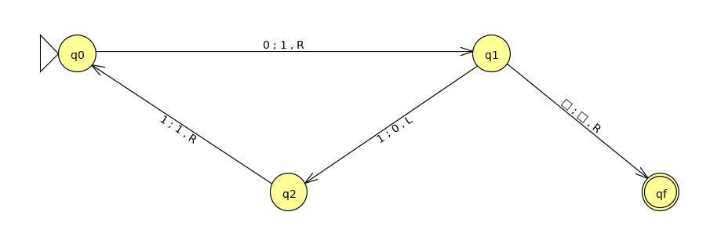
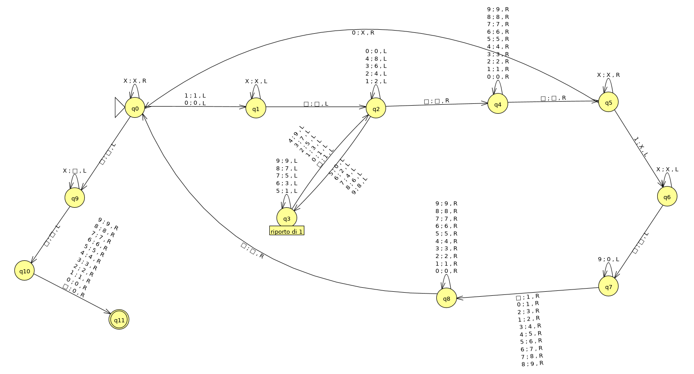
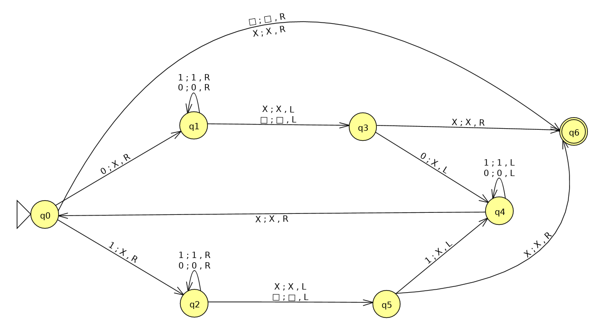
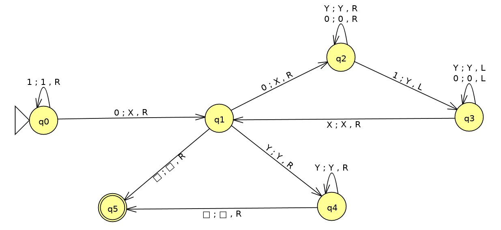

# Esercizi su Context Free Languages

## Pumping Lemma per CFL

### Esercizio 7.2.1.b pag 297

Provare che il seguente linguaggio non è context free.

L = {akbkci | i &le; k}

Il Pumping Lemma dei CFL dice:
Se L è un linguaggio libero dal contesto allora &forall; stringa in L, di lunghezza &ge; `n` è possibile scomporla in `z` = `uvwxy` con le segunti proprietà:

- |vwx| &le; n
- vx &ne; &epsilon;
- &forall; i &ge; 0 la stringa uviwxiy &isin; L

Quindi, per dimostrare che L non è context free, è sufficiente scegliere una parola tale che per qualunque costante `n` sia possibile trovare una `i` che faccia uscire dal linguaggio la parola pompata.

Scelgo la parola `z` = anbncn (&isin; L).
Per ogni split `z = uvwxy` i casi possibili sono i seguenti:

1. `v` e `x` contengono solo 'a' (almeno una 'a' in `vx`)
2. `v` e `x` contengono solo 'b' (almeno una 'b' in `vx`)
3. `v` contiene solo 'a' e `x` contiene solo 'b'
4. `v` e `x` contengono solo 'c' (almeno una 'c' in `vx`)
5. `v` contiene solo 'b' e `x` contiene solo 'c'

Nei casi 1, 2, 3 basta prendere `i = 0`. Ad esempio nel caso 1 la stringa uv0wx0y avrebbe rimosso delle 'a', ma nessuna 'b', quindi la parola non può essere in L.
Nel caso 3 sarà tolta almeno una 'a' e una 'b' quindi la stringa risultante avrà un numero di 'c' maggiore di quello di 'a' e 'b'.

Nel caso 4 scelgo `i = 2`. La stringa risultante avrà più 'c' che 'a' e 'b'.
Anche nel caso 5, con `i = 2`, aggiungendo 'b' queste non matcheranno più il numero di 'a' che resta inalterato. Allo stesso modo, aggiungendo 'c' il numero diventerà maggiore delle 'a'.

In nessuno di questi casi la stringa pompata &isin; L. Quindi `L` non può essere un linguaggio libero dal contesto.

## Normalizzazione di grammatiche (CNF)

### Esercizio 7.1.5 pag 286

Rendere la grammatica in forma CNF:

- S => aAa | bBb | &epsilon;
- A => C | a
- B => C | b
- C => CDE | &epsilon;
- D => A | B | ab

#### Eliminazione &epsilon;-produzioni
Le variabili annullabili sono: Z = {S, C, A, B, D}

- S => aAa | aa | bBb | bb
- A => C | a
- B => C | b
- C => CDE | DE | CE | E; <!--tutte le possibilità perchè C e D sono annullabili-->
- D => A | B | ab

#### Eliminazione produzioni unitarie:

Coppie unitarie:

1. (A, A) => (A, C), (A, E)
2. (B, B) => (B, C), (B, E)
3. (C, C) => (C, E)
4. (D, D) => (D, A), (D, B), (D, C), (D, E)
5. (S, S) => /

Quindi ∀(A, B) coppia unitaria, aggiungiamo ad A ogni produzione A → α, dove B → α è una produzione non unitaria.

Sostituisco e ottengo:

- S => aAa | aa | bBb | bb
- A => a | CDE | DE | CE
- B => b | CDE | DE | CE
- C => CDE | DE | CE
- D => ab | a | b | CDE | DE | CE

#### Eliminazione simboli inutili

Generatori &pi; = {a, b, S, A, B, D}

`C` non è _generatore_ perchè non contiene almeno una produzione costituita da tutti simboli generatori (anche terminali). `E` non è generatore perchè non ha nessuna produzione.

Quindi buttando via `C` ed `E` e tutte le produzioni che sontengono queste variabili, resta:

- S => aAa | aa | bBb | bb
- A => a
- B => b
- D => ab | a | b

I simboli _raggiungibili_ da `S` sono: R = {S, A, B, a, b}.
`D` non è raggiungibile, e quindi posso eliminarlo, includendo tutte le produzioni che lo includono:

- S => aAa | aa | bBb | bb
- A => a
- B => b

#### Portare in CNF:

- S => AAA | AA | BBB | BB
- A => a
- B => b

Che diventa:

- S => AC | AA | BD | BB
- A => a
- B => b
- C => AA
- D => BB

# Macchine di Touring

## Esercizi pag 347

### Esercizio 8.2.5.c
Considerando la TM `M` = ({q0, q1, q2, qf}, {0, 1}, {0, 1, □}, &delta;, q0, □, {qf}), descrivere il suo linguaggio.

La TM è la seguente:

L(M) = il linguaggio regolare `01*`

## Altri esercizi

### Esercizio T1
Definire una TM che converta un numero intero binario in decimale.

Esempio:
- 000 --> 0
- blank --> 0
- 1001 --> 9

La macchina `N` è così definita:

N = ({q0, q1, q2, ..., q11}, {0, 1}, {0, 1, □, X, 1, 2, 3, 4, 5, 6, 7, 8, 9}, &delta;, q0, □, {q11})

### Esercizio T2 (da esame)

Definire una TM che accetti stringhe binarie palindrome.

È sufficiente modificare l'esercizio 8.2.2.c del tutorato 8, che accettava i palidromi pari. Infatti sono state aggiunte solo le due transizioni da `q3` e `q5` verso lo stato accettante `q6`, che considerano il caso in cui la stringa sul nastro abbia lunghezza dispari.

`T` = ({q0, q1, q2, q3, q4, q5, q6}, {0, 1}, {0, 1, X, □}, &delta;, q0, □, {q6})

### Esercizio T3 (da esame)
Definire una TM che accetta L = {1n0m1m-1 | n &ge; 0, m > 0}

